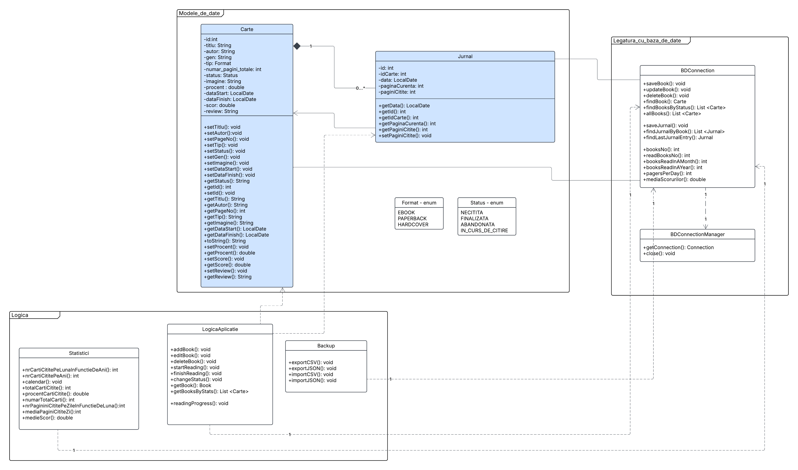
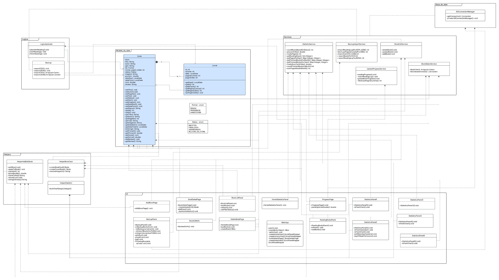
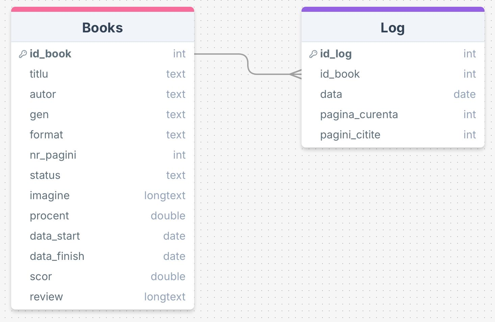
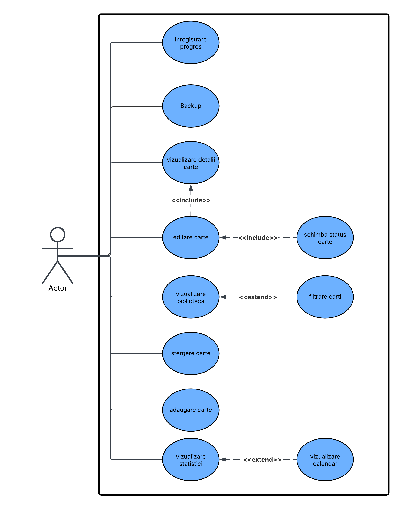

# 📚 Book Journal | Jurnal de Carte

---

# 🇬🇧 Book Journal

## 📖 Description
**Book Journal** is an application designed to help users manage 📚 their personal library and track their reading progress in a structured and intuitive way.

The application provides tools for book management, reading progress tracking, statistics visualization, and local data backups.

---

## 🎯 Objectives
- 📚 Manage a personal library (add, delete, edit books)
- 📊 View statistics about the number of books read by month and year
- 📈 View statistics about the number of pages read per day
- ⏱️ Track reading progress for each book
- 💾 Provide a local backup system
- 🖥️ Offer an interactive and easy-to-use interface

---

## 🏗️ Architecture

### 📐 UML Diagrams
Class diagrams and relationships:

### 🗄️ Database Diagram

---

## ⚙️ Features
The user can:
- ➕ Add and remove books from the library
- 👀 View the personal library
- ✏️ Update the number of pages read for a book
- 📊 View daily, monthly, and yearly statistics
- 🗓️ Use a reading calendar to track reading periods
- 🏷️ Manage book details (title, author, genre, page count, cover image, format)
- ⭐ Add ratings and reviews for completed books
- 💾 Save and restore data using `.csv` / `.json` backups

---

## 🧑‍💻 Use Case Diagram

---

## 📱 Application Screens

### 🏠 Home
- 📖 Displays currently reading books
- 📊 Shows statistics for the current month
- 💾 Provides backup options
- 👉 Click on a book → Reading Progress Screen
- 👉 Click on statistics → Statistics Screen

### ⏱️ Reading Progress Screen
- Updates the current page
- Allows changing the book status (Finished / Abandoned)

### 📖 Book Details Screen
- Displays complete book information
- ✏️ Edit book details
- ⏱️ Register reading progress
- 🔙 Return to Home

### 📊 Statistics Screen
- 📈 Pages read per day
- 📊 Books read per month and year
- 🗓️ Reading calendar view
- 🔽 Month and year selection menus
- 📌 Statistical indicators:
  - Total books read
  - Total books in library
  - Percentage of books read
  - Average pages read per day
  - Average rating score

### 📚 Library Screen
- Displays all books in the library
- 🔍 Filter books (read / unread / currently reading)
- ➕ Add new book
- 🗑️ Delete book

### ✏️ Edit Book Screen
- Edit all book-related information
- 💾 Save changes and return to Home

---

## 🧭 Navigation
The **Home**, **Library**, and **Statistics** screens are accessible through a bottom navigation bar 📍.

---

## 📌 Notes
This project was developed for educational purposes 🎓.

---

# 🇷🇴 Jurnal de Carte

## 📖 Descriere
**Jurnal de Carte** este o aplicație care permite utilizatorilor să își gestioneze 📚 biblioteca personală și să urmărească progresul lecturii într-un mod organizat și intuitiv.

Aplicația oferă funcționalități pentru administrarea cărților, înregistrarea progresului de lectură, vizualizarea statisticilor și realizarea de backup-uri locale.

---

## 🎯 Obiective
- 📚 Gestionarea unei biblioteci personale (adăugare, ștergere și editare cărți)
- 📊 Statistici privind numărul de cărți citite pe luni și ani
- 📈 Statistici privind numărul de pagini citite pe zile
- ⏱️ Înregistrarea progresului de lectură
- 💾 Sistem de backup local
- 🖥️ Interfață interactivă și ușor de utilizat

---

## 🏗️ Arhitectură

### 📐 Diagrame UML
Diagrama claselor și relațiile dintre ele:

### 🗄️ Diagrama bazei de date

---

## ⚙️ Funcționalități
Utilizatorul poate:
- ➕ Adăuga și șterge cărți din bibliotecă
- 👀 Vizualiza biblioteca personală
- ✏️ Actualiza numărul de pagini citite
- 📊 Vizualiza statistici zilnice, lunare și anuale
- 🗓️ Consulta un calendar al lecturii
- 🏷️ Gestiona informațiile fiecărei cărți (titlu, autor, gen, număr de pagini, copertă, tip)
- ⭐ Adăuga scor și review pentru cărțile citite
- 💾 Salva și restaura datele folosind backup-uri `.csv` / `.json`

---

## 📱 Ecranele aplicației

### 🏠 Home
- 📖 Afișează cărțile în curs de lectură
- 📊 Prezintă statisticile lunii curente
- 💾 Oferă opțiunea de backup
- 👉 Click pe o carte → Ecran Înregistrare Progres
- 👉 Click pe statistici → Ecran Statistici

### ⏱️ Ecran Înregistrare Progres
- Actualizarea paginii curente
- Modificarea statusului (Finalizată / Abandonată)

### 📖 Detalii Carte
- Afișează informații complete despre carte
- ✏️ Editare informații
- ⏱️ Înregistrare progres
- 🔙 Revenire la Home

### 📊 Statistici
- 📈 Pagini citite pe zile
- 📊 Cărți citite pe luni și ani
- 🗓️ Calendar cu perioadele de lectură
- 🔽 Selectare lună și an
- 📌 Indicatori statistici:
  - Numărul total de cărți citite
  - Numărul total de cărți din bibliotecă
  - Procentul de cărți citite
  - Media paginilor citite pe zi
  - Media scorurilor

### 📚 Bibliotecă
- Afișează toate cărțile din bibliotecă
- 🔍 Filtrare (citite / necitite / în curs)
- ➕ Adăugare carte
- 🗑️ Ștergere carte

### ✏️ Editare Informații
- Editarea tuturor informațiilor despre o carte
- 💾 Salvare modificări și revenire la Home

---

## 🧭 Navigare
Ecranele **Home**, **Bibliotecă** și **Statistici** sunt accesibile dintr-o bară de navigare 📍 situată în partea inferioară a aplicației.

---

## 📌 Notă
Acest proiect a fost realizat în scop educațional 🎓.
